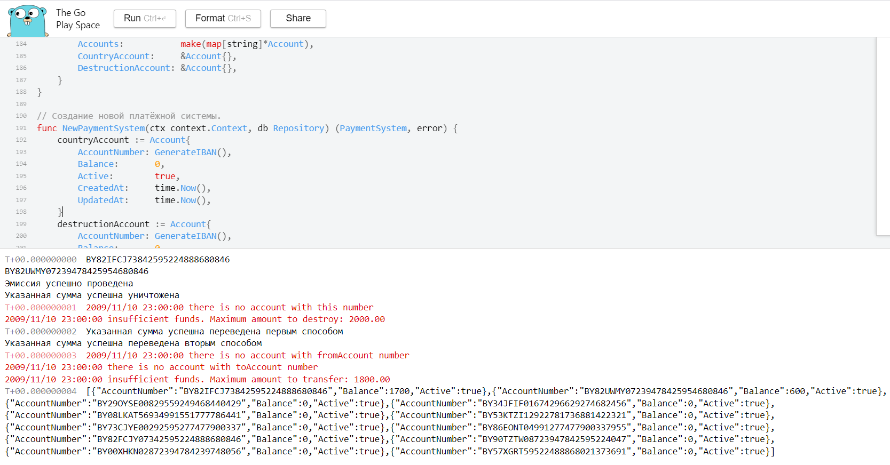

# Это небольшое приложение эмулирует работу простейшей платежной системы

Платежная система не использует ни базу данных, ни файловую систему, а вся информация “живет” в оперативной памяти только во время работы программы.

В платежной системе каждый клиент имеет какой-то уникальный номер счета в формате IBAN, используемом в Республике Беларусь (28 букво-цифр). Например: вида “BY04CBDC36029110100040000000”.

При запуске программы в системе еще нет ни одного счета, кроме двух специальных счетов: счет государства, на который осуществляется “эмиссия” денег; и счет на который отправляются деньги для “уничтожения”.

Программа обладает следующим функционалом:

- выводить номер специального счета для “эмиссии”;
- выводить номер специального счета для “уничтожения”;
- осуществлять эмиссию, по добавлению на счет “эмиссии” указанной суммы;
- осуществлять отправку определенной суммы денег с указанного счета на счет “уничтожения”;
- открывать новый счет, вы можете генерировать случайный номер счета или по вашему алгоритму, или использовать сгенерированный вне вашего класса номер счета просто как параметр;
- осуществлять перевод заданной суммы денег между двумя указанными счетами; обеспечить два варианта данной команды:
    1) с несколькими параметрами
    2) с единственным параметром в формате json (структуру придумайте сами);
- выводить список всех счетов, включая специальные, с указанием остатка денежных средств на них и их статуса (“активен” или “заблокирован”). Выводить необходимо в формате json.

**Скриншот выполнения в онлайн компиляторе**

**Ссылка на онлайн компилятор**
[COD](https://goplay.space/#j-WnRlefcsE)
